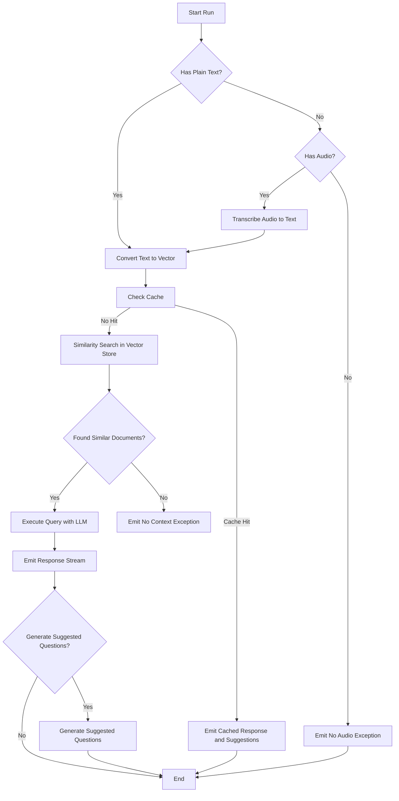

## Overview

This project is a sophisticated chatbot application designed to leverage the power of Retrieval-Augmented Generation (RAG) for providing intelligent and contextually aware responses. Built with FastAPI, a modern web framework for building APIs with Python, this chatbot is designed to handle real-time interactions efficiently using WebSockets for chat communication.


| Sonar Cloud Quality Status                                                                                                                                                                                                                                    | Analysis Breakdown                                                                                                                                                                                                                                                                                                                                                                                                                                                                                                                                                                                                                                                                                                                                                                                                                                                                                                                                                                                                                                                                                                                                                                                                                                                                                                                                                                                                                                                                                                                                                                                                                                                                                                                                                                                                                                                                                                                                                                                                                                                                                                                                                                                                                                                                                                                                                                                                                                                                                                                  |
|---------------------------------------------------------------------------------------------------------------------------------------------------------------------------------------------------------------------------------------------------------------|-------------------------------------------------------------------------------------------------------------------------------------------------------------------------------------------------------------------------------------------------------------------------------------------------------------------------------------------------------------------------------------------------------------------------------------------------------------------------------------------------------------------------------------------------------------------------------------------------------------------------------------------------------------------------------------------------------------------------------------------------------------------------------------------------------------------------------------------------------------------------------------------------------------------------------------------------------------------------------------------------------------------------------------------------------------------------------------------------------------------------------------------------------------------------------------------------------------------------------------------------------------------------------------------------------------------------------------------------------------------------------------------------------------------------------------------------------------------------------------------------------------------------------------------------------------------------------------------------------------------------------------------------------------------------------------------------------------------------------------------------------------------------------------------------------------------------------------------------------------------------------------------------------------------------------------------------------------------------------------------------------------------------------------------------------------------------------------------------------------------------------------------------------------------------------------------------------------------------------------------------------------------------------------------------------------------------------------------------------------------------------------------------------------------------------------------------------------------------------------------------------------------------------------|
| [](https://sonar.dev.displayme.net/dashboard?id=3AAI-API&branch=devops-test-task) | [](https://sonar.dev.displayme.net/dashboard?id=3AAI-API&branch=devops-test-task) [](https://sonar.dev.displayme.net/dashboard?id=3AAI-API&branch=devops-test-task)   [](https://sonar.dev.displayme.net/dashboard?id=3AAI-API&branch=devops-test-task) [](https://sonar.dev.displayme.net/dashboard?id=3AAI-API&branch=devops-test-task) [](https://sonar.dev.displayme.net/dashboard?id=3AAI-API&branch=devops-test-task) [](https://sonar.dev.displayme.net/dashboard?id=3AAI-API&branch=devops-test-task) [](https://sonar.dev.displayme.net/dashboard?id=3AAI-API&branch=devops-test-task) [](https://sonar.dev.displayme.net/dashboard?id=3AAI-API&branch=devops-test-task) [](https://sonar.dev.displayme.net/dashboard?id=3AAI-API&branch=devops-test-task) |

### Key Features

- **RAG (Retrieval-Augmented Generation)**: Combines retrieval-based approaches with generative models to offer accurate and contextually relevant responses to user queries.
- **FastAPI Backend**: Utilizes the speed and simplicity of FastAPI to handle API requests and WebSocket connections, ensuring smooth and responsive communication.
- **WebSocket Communication**: Enables real-time, bidirectional communication for chat interactions, enhancing user experience with instant responses.
- **Vector Search with Qdrant**: Employs Qdrant, a high-performance vector database, to perform similarity searches and manage stored document embeddings efficiently.

### Technology Stack

- **Python**: Core programming language for developing the application.
- **FastAPI**: Backend framework for handling API and WebSocket communications.
- **Qdrant**: Vector search engine used for document retrieval and similarity searches.
- **OpenAI Models**: Leverages OpenAI's models for natural language understanding and response generation.

### Use Cases

- **Customer Support**: Provides instant responses to customer inquiries, enhancing user satisfaction and reducing response time.
- **Information Retrieval**: Fetches relevant information from a knowledge base, enabling users to obtain accurate answers quickly.
- **Conversational AI**: Engages users in meaningful conversation, simulating human-like interactions for a variety of applications.

### Getting Started

To get started, clone the repository and follow the setup instructions provided in the `README.md`. Ensure you have the necessary environment variables configured for API keys and database access.

## Project Structure
```
chat_bot/
├── api/
│   ├── ws/
│   │   ├── __init__.py
│   │   └── api.py
└── core/
    ├── __init__.py
    ├── audit_log.py
    ├── config.py
    ├── db_setup.py
    ├── middleware.py
    └── security.py
├── db_snapshot/
│   └── 360inControl.snapshot
├── static/
├── server/
│   ├── __init__.py
│   └── main.py
├── tests/
│   ├── __init__.py
│   ├── conftest.py
│   └── test_workflow.py
└── tools/
    ├── __init__.py
    ├── chat_pipeline.py
    ├── llm.py
    ├── prompts.py
    └── retriever.py
.dockerignore
.gitignore
.pre-commit-config.yaml
azure-pipelines.yml
docker-compose.yml
Dockerfile
pyproject.toml
README.md
requirements.txt
tox.ini
```

### Project Settings
| Variable                    | Description                                                           |
|-----------------------------|-----------------------------------------------------------------------|
| DEBUG                       | Enables or disables debug mode.                                       |
| APP_HOST                    | Host address for the application.                                     |
| APP_PORT                    | Port on which the application runs.                                   |
| RELOAD                      | Enables or disables auto-reloading.                                   |
| APP_LOG_LEVEL               | Log level for the application. Options: critical, error, info, debug. |
| ENVIRONMENT                 | Deployment environment. Options: local, platform, production.         |
| WS_MAX_QUEUE                | Maximum WebSocket message queue size.                                 |
| WORKERS                     | Number of worker processes.                                           |
| OPENAI_API_KEY              | API key for accessing OpenAI services.                                |
| OPENAI_BASE_MODEL           | Base model name for OpenAI GPT.                                       |
| OPENAI_EMBEDDING_BASE_MODEL | Model name for OpenAI embedding.                                      |
| EMBEDDING_DIMENSION         | Dimensionality of the embedding vectors.                              |
| JWT_SECRET_KEY              | Secret key for signing JWT tokens.                                    |
| JWT_ALGORITHM               | Algorithm used for JWT encoding.                                      |
| QDRANT_CLOUD                | Indicates if Qdrant is cloud-hosted.                                  |
| QDRANT_URL                  | URL for Qdrant cloud instance.                                        |
| QDRANT_API_KEY              | API key for Qdrant access.                                            |
| QDRANT_MAIN_COLLECTION      | Name of the main collection in Qdrant.                                |
| QDRANT_CACHE_COLLECTION     | Name of the cache collection in Qdrant.                               |
| QDRANT_SEARCH_LIMIT         | Limit on the number of search results from Qdrant.                    |
| QDRANT_CACHE_SCORE          | Threshold score for cache results in Qdrant.                          |
| FORWARDED_ALLOW_IPS         | List or string of allowed forwarded IPs.                              |

### Process Flow

The main functions of the `PipeLine` class are represented in the flowchart below.



### Build Trigger
- Make sure to set the OS environment variables in side docker-compose file

```commandline
docker-compose.exe run --rm --build -p 8080:80 chat_bot local
```

### Run Tox Trigger
```commandline
tox run -e pre-commit
tox run -e test
```

### Run Debug with Pytest
```commandline
pytest --no-cov
```
